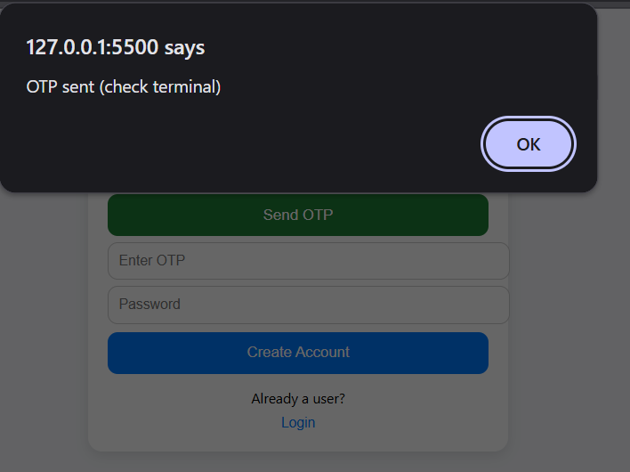
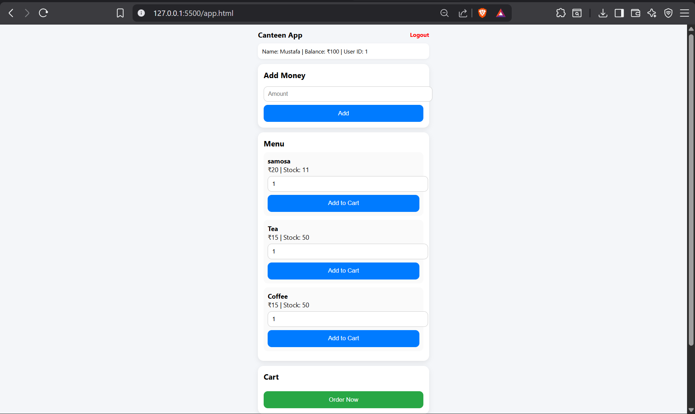
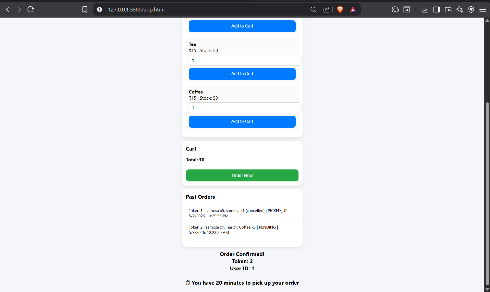
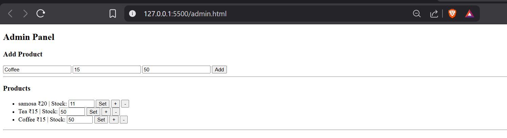

# Smart Canteen Pre-Order System

A web-based application that allows students to pre-order food from the canteen, reducing waiting time and improving efficiency during peak hours.

---

## Features

* User authentication with OTP and password
* Pre-order food before arriving at the canteen
* Wallet system for adding balance and making payments
* Cart system with quantity management
* Order history with status (PENDING, PICKED_UP, CANCELLED)
* Token-based order system for pickup
* Admin panel for:

  * Adding products
  * Managing stock
  * Viewing orders

---

## Tech Stack

Frontend:

* HTML
* CSS
* JavaScript

Backend:

* Node.js
* Express.js

Database:

* MySQL

---

## Screenshots

### Signup and OTP Verification

### Menu and Cart System

### Order Confirmation and History

### Admin Panel

---

## How to Run

1. Install dependencies:
   npm install

2. Start the server:
   node server.js

3. Open in browser:
   http://localhost:3000

---

## Project Overview

This system is designed to reduce queues in college canteens by allowing users to place orders in advance. Each order generates a unique token, enabling quick pickup without waiting in long lines. The admin panel allows canteen staff to manage menu items and stock efficiently.

---

## Future Improvements

* Online payment integration
* Real-time order tracking
* Notifications for order status
* Mobile-friendly UI improvements
