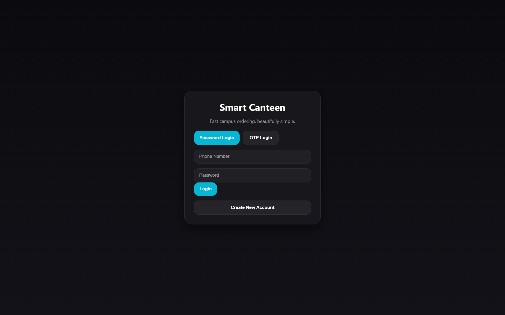
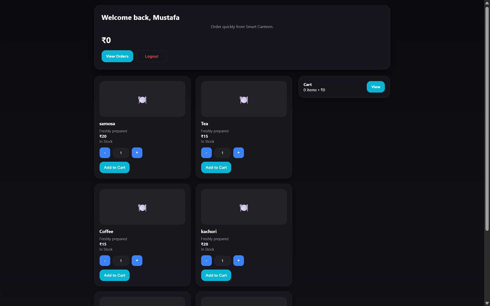
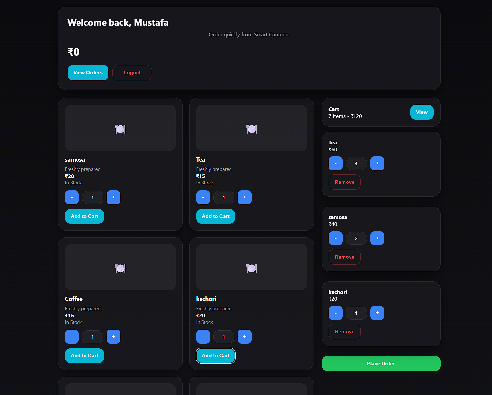
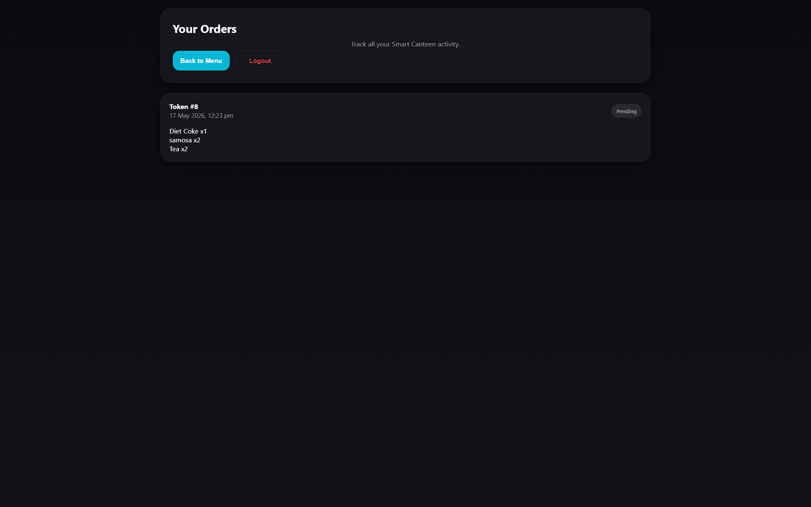
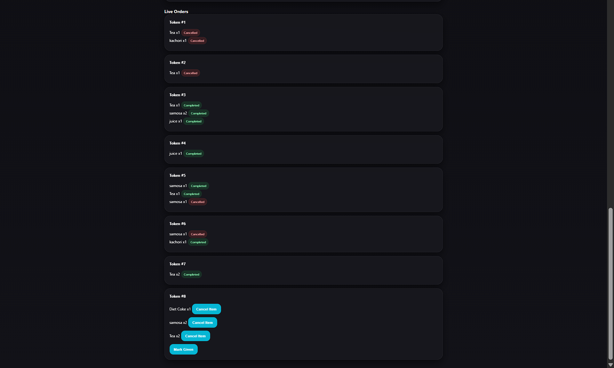
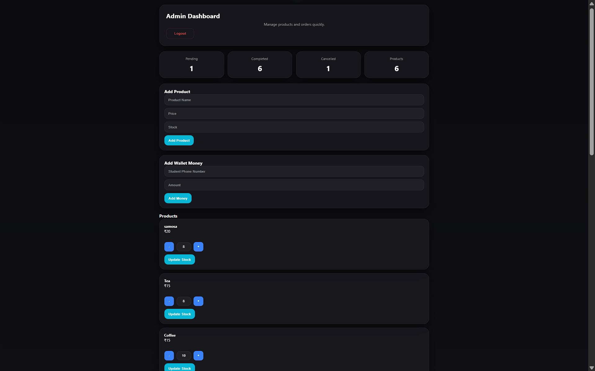

Smart Canteen Pre-Order System

This is a full-stack Smart Canteen web application that I’ve been building as a practical real-world project with the goal of eventually implementing it in a college canteen.

The idea behind this project is simple: reduce waiting time in canteens by allowing students to browse the menu, place orders in advance, pay digitally through an internal wallet, and collect their food using generated tokens.

This project is still actively being improved and refined as I continue learning and building.

What the project currently does

Students can:

Browse available food items from the menu

Add items to cart with quantity controls

Place prepaid orders using wallet balance

Receive a token number after placing an order

Track order history and status updates

Cancel individual items instead of entire orders

Receive automatic wallet refunds when items are cancelled

Use the system comfortably on mobile devices

Admins can:

View incoming orders

Manage product stock

Add new food items

Update stock instantly

Mark orders as picked up

Manage student wallet balances

Search users by phone number for wallet top-ups

Monitor order activity from the admin dashboard

Built using

Frontend:
HTML
CSS
JavaScript

Backend:
Node.js
Express.js

Database:
MySQL

Authentication & Security:
JWT Authentication
bcrypt
OTP verification

Project Screenshots

Login Page

Student Dashboard

Cart and Ordering Flow

Order History

Admin Dashboard

Admin Order History

Project Status

This project is actively under development.

Some of the major improvements recently added include:

A complete UI redesign with a cleaner mobile-first experience

JWT-based authentication with secure login flow

Wallet-based payment handling

Admin-controlled wallet top-ups

Live stock validation

Improved cart interactions

Order token generation

Individual item cancellation with automatic refunds

Timeout handling for unclaimed orders

Modern toast notifications replacing browser alerts

Improved admin controls and order handling

Planned improvements

Product image uploads

More advanced order states such as Preparing / Ready for Pickup

Admin analytics dashboard

Safer database transaction handling

Production deployment

Further UI polishing

Usage Notice

This repository is shared for project showcase and portfolio purposes only.

The code is not licensed for reuse, redistribution, modification, or deployment without explicit permission from the author.

About me

Built by Mustafa Kazmi

BCA Student | Frontend Developer | Exploring Backend Development and Cybersecurity

GitHub:
https://github.com/MustafaKazmi
